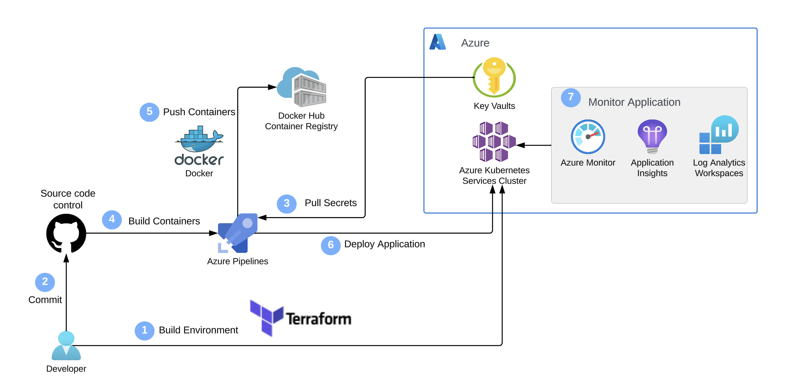
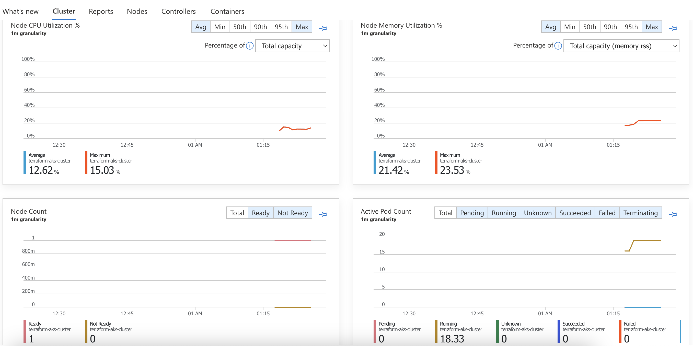
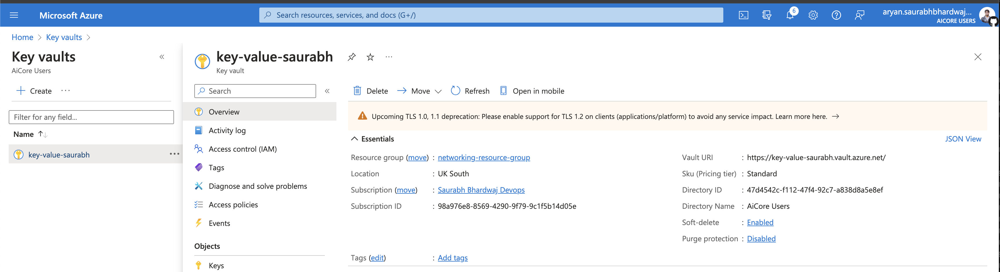
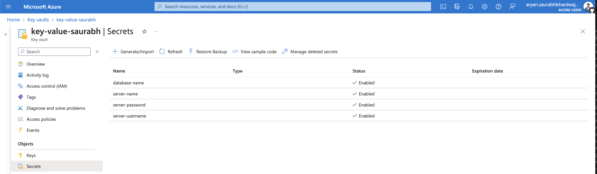

# Web-App-DevOps-Project

Welcome to the Web App DevOps Project repo! This application allows you to efficiently manage and track orders for a potential business. It provides an intuitive user interface for viewing existing orders and adding new ones.

## Table of Contents

- [Features](#features)
- [Getting Started](#getting-started)
- [Technology Stack](#technology-stack)
- [Contributors](#contributors)
- [License](#license)

## Features

- **Order List:** View a comprehensive list of orders including details like date UUID, user ID, card number, store code, product code, product quantity, order date, and shipping date.
  

- **Pagination:** Easily navigate through multiple pages of orders using the built-in pagination feature.
  

- **Add New Order:** Fill out a user-friendly form to add new orders to the system with necessary information.
  

- **Data Validation:** Ensure data accuracy and completeness with required fields, date restrictions, and card number validation.

### DevOps Pipeline Architecture

## Getting Started

### Prerequisites

For the application to succesfully run, you need to install the following packages:

- flask (version 2.2.2)
- pyodbc (version 4.0.39)
- SQLAlchemy (version 2.0.21)
- werkzeug (version 2.2.3)

## Usage

To run the application, you simply need to run the `app.py` script in this repository. Once the application starts you should be able to access it locally at `http://127.0.0.1:5000`. Here you will be meet with the following two pages:

1. **Order List Page:** Navigate to the "Order List" page to view all existing orders. Use the pagination controls to navigate between pages.

2. **Add New Order Page:** Click on the "Add New Order" tab to access the order form. Complete all required fields and ensure that your entries meet the specified criteria.

## Technology Stack

- **Backend:** Flask is used to build the backend of the application, handling routing, data processing, and interactions with the database.

- **Frontend:** The user interface is designed using HTML, CSS, and JavaScript to ensure a smooth and intuitive user experience.

- **Database:** The application employs an Azure SQL Database as its database system to store order-related data.

## Containerizing the App:
Before you begin, ensure Docker Engine and Docker CLI are installed on your system.

### Building a Docker Image:

- **Clone the repository:** git clone git@github.com:bhardwaj-saurabh/Web-App-DevOps-Project.git.

- **Navigate into the project directory:** cd Web-App-DevOps-Project.

- **Build the Docker image:** docker build -t aryansaurabhbhardwaj/devops-app.

### Running the Docker Image:
- **Execute:** docker run -p 5000:5000 devops-orders-project.

Access the app at http://localhost:5000.

### Tagging and Pushing to Docker Hub:

- **Tag the image:** docker tag devops-app <docker-hub-username>/devops-app:latest.

- **Push to Docker Hub:** docker push <docker-hub-username>/devops-app:latest.

### Pulling from Docker Hub:

- **Image is on Docker Hub, pull it:** docker pull <docker-hub-username>/devops-app:latest and run as before.

## Cleanup:

- Remove containers using docker rm [container-id] and images with docker rmi [image-id]. 

- Check containers with docker ps -a and images with docker images -a.

## Provisioning an AKS Cluster with Terraform:

### Prerequisites:

- Install Terraform. 

- Verify the installation with terraform -v.

## Networking Module Setup:

### Create a Terraform project and networking module directory:

- mkdir aks-terraform

- cd aks-terraform

- mkdir networking-module

- cd networking-module

- touch `main.tf`, `outputs.tf`, `variables.tf`

### Define Variables in variables.tf:

- **resource_group_name:** Name for the network resource group.

- **location:** Azure region for resource provisioning.

- **vnet_address_space:** Address space for the virtual network.

### Define Resources in main.tf:

- Azure Resource Group

- Virtual Network (VNet) for AKS

- Control Plane Subnet

- Worker Node Subnet

### Output Variables in outputs.tf:

- **vnet_id:** ID of the created VNet.

- **control_plane_subnet_id:** ID of the control plane subnet.

- **worker_node_subnet_id:** ID of the worker node subnet.

- **networking_resource_group_name:** Name of the resource group for networking.

- **aks_nsg_id:** ID of the Network Security Group.

### Initialize Terraform Module:

terraform init in the networking-module directory.

## Provision the worker nodes component of the AKS cluster:

### Create Directory and Terraform Files:

- Inside aks-terraform, create aks-cluster-module.
- Inside aks-cluster-module module, create main.tf, outputs.tf, and variables.tf.

### Define Variables in variables.tf:

- **aks_cluster_name:** Name of the AKS cluster.

- **cluster_location:** Azure region for the AKS cluster.

- **dns_prefix:** DNS prefix of the cluster.

- **kubernetes_version:** Kubernetes version for the cluster.

- **service_principal_client_id:** Client ID for the associated service principal

- **service_principal_secret:** Client Secret for the service principal.

- **resource_group_name:** Specify the resource group for the VNet.

- **vnet_id:** ID of the Virtual Network.

- **control_plane_subnet_id:** ID for the control plane subnet.

- **worker_node_subnet_id:** ID for the worker node subnet.

### Define Resources in main.tf:

Configure `azurerm_kubernetes_cluster` to create the AKS cluster, including default node pool and service principal settings.

### Output Variables in outputs.tf:

- **aks_cluster_name:** Stores the name of the AKS cluster.

- **aks_cluster_id:** Stores the ID of the AKS cluster.

- **aks_kubeconfig:** Stores the Kubernetes config file, crucial for managing the AKS cluster with kubectl.

### Initialize the Module:

Run `terraform init` in the aks-cluster-module directory to initialize Terraform.

## create the main configuration file for provisioning your AKS cluster with Terraform:

### Define Terraform Block:

Specify the Azure provider and set the required version, for instance, version 3.0.0.

### Provider Block Setup:

Configure the Azure provider. Inside this block, include features {} (which can be empty for now).
Set up `client_id`, `client_secret`, `subscription_id`, and `tenant_id`. These are obtained by running az ad sp create-for-rbac with appropriate parameters, including your subscription and resource group details.

### Integrate Networking Module:

Reference the networking module you previously created. Include the path to this module and define any necessary values for its variables.

### AKS Cluster Module Integration:

Set up the AKS Cluster module, inputting variables like `resource_group_name`, `vnet_id`, `control_plane_subnet_id`, `worker_node_subnet_id`, and `aks_nsg_id`. These should correspond to the outputs from your networking module.

## Deploy your application using Kubernetes:

Deployment and Service Manifests: Create application-manifest.yaml with two main Kubernetes objects:

- Deployment and Service.

### Deployment Configuration:

- **apiVersion:** Specify Kubernetes API version, e.g., apps/v1.

- **kind:** Set to Deployment.

- **metadata.name:** Name your deployment, e.g., flask-app-deployment.

- **spec.replicas:** Define the number of pods, e.g., 2.

- **spec.selector.matchLabels:** Ensure it matches labels of the pods to manage.

- **template.metadata.labels:** Label your pods for selection.

- **template.spec.containers:** Configure the container, including name, image, and ports.

- **strategy:** Define the update strategy, like RollingUpdate.

### Service Configuration:

- **kind:** Set to Service.

- **metadata.name:** Name the service.

- **spec.selector:** Match labels of the pods to target.

- **spec.ports:** Define service ports.

- **spec.type:** Choose ClusterIP for internal access.

### Testing and Validation:

- Run kubectl get nodes, kubectl get pods, kubectl get services.

- Verify deployment in AKS cluster through Azure Portal.

- For local testing, use kubectl port-forward.

### Distribution:

- **Internal Use:** Use a LoadBalancer service for internal distribution, exposing an external IP.

- **External Users:** Implement an ingress controller for external access, defining hostname, path, and targeted pods.

## Building the CI/CD Pipeline:

- **Pipeline Trigger:** Configured to activate on changes to the main branch.

- **Pipeline Environment:** Uses an Ubuntu image for building and releasing.

### Build Stage - Docker Task:

- Task Docker@2 handles the build process.

- Connects to Docker Hub via a service connection for secure interactions.

- Builds and pushes the Docker image, referencing the project's Dockerfile.

- Tags the built image as latest.

### Release Stage - Kubernetes Deployment:

- Task KubernetesManifest@1 manages deployment to AKS.

- Deploys using the application-manifest.yaml from the repository.

- Utilizes a Kubernetes service connection for cluster access.

### Validation and Testing:

- Confirm pipeline success via Azure DevOps logs.
- Verify deployment with `kubectl get pods` and `kubectl get services`.
- Test application functionality locally using port-forwarding.

## Monitoring the Cluster:

### Charts for AKS Cluster Monitoring:

- **Average Node CPU Usage:** Tracks the CPU usage across nodes.

- **Average Pod Count:** Monitors the number of running pods.

- **Average Disk Usage:** Observes disk utilization on nodes.

- **Bytes Read and Written Per Second:** Analyzes data transfer rates.

### Log Analytics:

- **Node CPU and Memory Usage:** Logs average CPU and memory usage.

- **Pod Counts With Phase:** Tracks pod counts in different phases.

- **Warning Values in Container Logs:** Searches for warning signals.

- **Monitoring Kubernetes Events:** Keeps track of Kubernetes events and health.

### Alerts Configuration:

- Configured to trigger on high disk usage, indicating potential performance issues.

### Mitigation Strategies for Alerts:

- Analyze metrics and logs to assess severity.

- Possible actions include deploying additional nodes and distributing traffic.

- Document each alert and response for future reference.

- Conduct post-incident reviews for root cause analysis and preventive measures.

## Managing Secrets and Integrating AKS with Azure Key Vault:

### Azure Key Vault Setup:

- Create a Key Vault, e.g., kub-cluster-key-vault, for secure information storage.

- Assign yourself as the Key Vault Administrator for full management capabilities.

### Storing Secrets:

- Store crucial database credentials in the Key Vault, like server URL, database name, username, and password.

### AKS Integration with Key Vault:

- Enable Managed Identity on your AKS cluster using az aks update.

- Retrieve Managed Identity details with az aks show.

- Assign the "Key Vault Secrets Officer" role to the Managed Identity for access to Key Vault secrets.

### Application Code Modification:

- Install necessary libraries: azure-identity and azure-keyvault-secrets.

- Implement code to retrieve secrets from Key Vault and use them in the database connection setup.

## Contributors 

- [Maya Iuga]([https://github.com/<yourusername>](https://github.com/maya-a-iuga))

## License

This project is licensed under the MIT License. For more details, refer to the [LICENSE](LICENSE) file.
